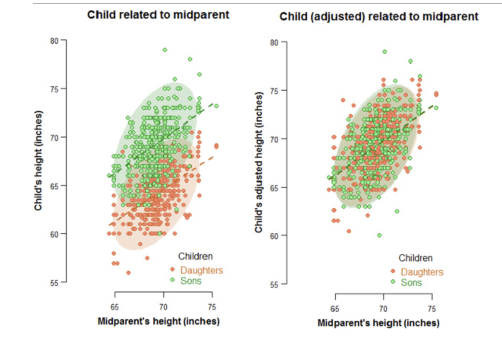

title="Final Project - ALY 6010"


<P>

<BR>

<CENTER>

<FONT size=6, color="blue">
**Final Project Report** </FONT>

<FONT size=5, color="#F9042F">

<BR>**Probability Theory and Introductory Statistics** </FONT>


<P>

<FONT size=4, color="#F94104"> ALY 6010 - 71579 </FONT>


<P>

<BR>
<FONT size=5, color="#0493F9"> 
<BR>
**Maheswar Raju Narasaiah**

<FONT size=5, color="Black"> 
Prof: Dr. Dee Chiluiza 

Date:`r format(Sys.time(), '%d %B, %Y')`

</CENTER>


<P>
<BR> <B>
<FONT SIZE = 4.75, COLOR ="#030E4F">
1. INTRODUCTION 
</FONT>
</BR></B>

<FONT SIZE = 4.75, COLOR ="#8E348B">
**1.1. History of Correlation and Linear Regression, and Their Difference**
</FONT>
<FONT SIZE = 4>

-- ***History of Correlation and Linear Regression***

The concept of correlation may be dated to the early nineteenth century but the work on the binomial normal distribution through the French geologist Bravais in the middle of the 19th century was essential to its eventual definition. Whereas Francis Galton, Mendel's contemporary and Darwin's cousin, grasped the concept of correlation implicit in the bivariate normal density function, the mathematical formulation was left to Pearson years later. Galton got the notion using data on n=934 children from m=205 families, with p=4 variables: daughter's height Y1, son's height Y2, mother's height X1, and father's height X2. For the time being, we will disregard the fact that the families have several children, ranging from one to fifteen; we will revisit to this issue and how to deal with it later.

Galton boosted all female heights by 8%, recognizing that the link between kid and parent had to be for a single population, and that there were actually two populations, males and females. Then, in order to have only one value for each parent, he calculated "midparent" averages X=12(X1+X2) using the incremented values of X1. His research resulted in the development of linear regression as well as an initial estimate of the slope of children's heights in relation to midparents' heights as roughly 2/3 and of the correlations as approximately 1/2 (Cuadras & Greenacre, 2022).

Figure 1 shows scatterplots of children's heights versus those of their midparents. (Left) Original children's heights, with ellipses encompassing 95% of the spots in each case. Simple linear regression analysis through each group of points are represented by dashed lines. (Right) The same plot with adjusted heights for the daughters, with ellipses and regression lines nearly identical. The overall group's computed slope is 0.713, and the correlations is 0.497.


```{r  echo=FALSE, message=FALSE, warning=FALSE}

```

In Fig. 1, the heights Y1 and Y2 of both the daughters and sons are plotted versus the midparents' heights X, and then on the right, the plot with the daughters' heights adjusted up, revealing that the two trying to cover ellipses (covering 95% of the points in each case) are practically identical, as are the two regression lines. The notion that Galton was working with two data sets is plainly seen on the left, and the merger into one population is shown to be quite successful on the right, thanks to the 8% modification of the daughters' heights. This "single population" data set's actual computed slope is 0.713, which is marginally greater than 2/3, and the coefficient of correlation is 0.497, which is extremely near to 1/2. The connection between daughters' and midparents' heights is 0.513, while the correlation between sons' and midparents' heights is 0.483.

Several years later, Karl Pearson, using the bivariate normal distribution, constructed the correlation coefficient in its famous form in terms of the covariance and two variances: rxy=Sxy/SxxSyy, and conducted his own research of the parent-child relationship in heights, yielding an estimated slope of 0.52 and a correlation of 0.51.
Galton's work "Regression towards mediocre in hereditary stature," from whence the name regression derives, was inspired by the fact that the slope was less than one. The regression model can predict, for example, that changes such as increased parents would've had taller-than-average offspring, but their heights were closer to the average then their parents, i.e., there was a "regression to the mean".


-- ***Difference Between Correlation And Determination Coefficients***

The correlation coefficient between two data sets reflects the strength of their link. The values range from -1 to 1, with -1 being the least and 1 being the highest. The negative number indicates that one data increases followed by another data decreases, whereas the positive value indicates that both data increase or decrease simultaneously.

The determination coefficient is the correlation coefficient squared, hence the value is always positive and the highest value is 1 (Bluman, 2014).

For example, if two data sets A and B have a correlation coefficient of 0.7, then A relates pretty well to B, with increasing values of A followed by increasing values of B and vice versa.

The determination coefficient is 0.49, which is the squared correlation coefficient. It means that B determines the fluctuation of the data in A 49% and vice versa. In other words, the remaining 51% could be determined by other factors.

<FONT SIZE = 4.75, COLOR ="#8E348B">
**1.2. Importance and Application of Simple and Multiple Regression**
</FONT>
<FONT SIZE = 4>

-- ***Importance of Simple and Multiple Regression***

The advantages of regression analysis are numerous: The regression method of forecasting is used for forecasting and determining the causal link between variables, as the name implies. The benefits of linear regression, which is a process for modeling the value of one variable on the value(s) of one or more other variables, are an important related, almost equivalent idea (Darlington & Hayes, 2016).

The significance of regression analysis stems from the fact that it is all about data: data consists of numbers and figures that characterize your business. The benefits of regression analysis include the ability to crunch the data to assist you make better decisions for your organization now and in the future. The regression forecasting method entails investigating the correlations between data points, which can assist you in:

- Forecast weather in the short and long term.
- Recognize inventory levels.
- Recognize both supply and demand.
- Examine and comprehend how various variables affect every one of these things.

-- ***Application of Simple and Multiple Regression in Manafacturing and Retail***

Organizations have gathered a vast quantity of complex data over time, which can yield invaluable amounts of fresh insights. Unfortunately, without the proper analysis, this data is useless. Regression analysis can reveal a relationship between numerous variables by revealing patterns that were previously overlooked (Teeboom, 2019). "For example, examination of data from point of sale systems and purchase accounts may show reveal trends like increase in demand on specific days of the week or at certain seasons of the year. By recognizing these insights, you can maintain appropriate supply and staff before an increase in demand occurs."

- Manafacturing

Efficiency of operation: Big Industrial Plant can use regression analysis to optimize their processes. A manufacturing manager, for example, might use regression analysis to determine the effect of new cooling system on new microprocessor made in those plant, such as how long their speed might be. 

- Retail

Regression analysis is useful not only for generating information for decision making, in addition to identifying judgment errors. For example, store executives may believe that expanding after-hours shopping will enhance profits. Regression analysis, on the other hand, examines all of the variables that surround this action and may indicate that supporting the rise in operating expenditures due to extended working hours (such as more worker labor charges) will considerably reduce profit. Regression analysis gives quantitative support for judgments and helps to avoid mistakes caused by intuition.

<FONT SIZE = 4.75, COLOR ="#8E348B">
**1.3. Application of Hypothesis Testing In The Context of Regression Analysis**
</FONT>
<FONT SIZE = 4>

The Hypothesis testing in context of regression analyis is used to check the significance of correlation Cofficient. The correlation coefficient (r) has a range of + 1 to 1. Since the value of r is computed from data gathered from samples, there are two alternatives when r is not zero: either the value of r is higher enough to indicate that there is a substantial linear connection between the variables, or the value of r is due to chance. To find out  the connection between the dependent and independent values in the data set, we must rely on hypothesis testing to make that decision.

Here is stated hypthesis statement that we use for simple regression:

H0: 𝜌 = 0 - x and y variables in the population have no correlation. 

H1: 𝜌 ≠ 0 - x and y have significant correlation between the them.

When the null hypothesis is rejected based on confidence interval we chose , We can deduce that there is a substantial difference between r and 0. When the null hypothesis is not rejected, the value of r is most likely due to chance (Tuitoek, 2021).

<FONT SIZE = 4.75, COLOR ="#8E348B">
**1.4. Importance Of Final Project To Demonstrate All The Analytical Skills You Gained During The Class**
</FONT>
<FONT SIZE = 4>

Below are the three most important analytical skills I gained in Final Project.

<B>
- Writing a Data Analysis Report</B>

I have learned how to write professional analytical reports which are to provide a thorough understanding of an issue and how the problem will be resolved. These reports are a cross between proposals and informational documents. I have also came to know that primary purpose of analytical reports extends beyond the identification and analysis of the problem to include the presentation of a solution using recommendations based on evidence to solve a problem where previous attempts failed (Zaric, 2022). Also, I realized that writing up the results of a data analysis is not a skill that anyone is born with. It requires lot of practice and, at least in the beginning, a bit of guidance.

<B>
- Coding Skills</B>

One of the greatest strengths which I gained by taking this class is learning coding in R and doing problem-solving using critical thinking. I have also developed computational thinking which helps me breaks down complex problems into smaller, more manageable pieces and then follows a set process to create an algorithmic solution that can be replicated by humans or computers. This has provided me, the problem-solving skills that can be used in my career.

<B>
- Providing Right Visualization and Gaining Insights </B>

I have learned which graphs should I present based on problem and data, how we can gain insights and take correct decisions. It is very important practice because it helps to make data easier for the human brain to absorb and draw insights from, when information is translated into a visual context, such as a map or graph. The primary purpose of data visualization is to make identifying patterns, trends, and outliers in huge data sets easier. Information graphics, information visualization, and statistical graphics are all terms that are frequently used interchangeably (Gomes, 2018).

<FONT SIZE = 4.75, COLOR ="#8E348B">
**1.5. Advantages Of Using R For Data Analysis**
</FONT>
<FONT SIZE = 4>

<B>
  A. R as a programming language.</B>

R was created by statisticians and data scientists to perform statistical study, and it is still the computer language of choice for most statisticians today. The syntax of R makes it simple to design complicated statistical models with a few lines of code. You should be able to find support for any statistical study you need to do because so many statisticians use and contribute to R packages.

R is the data and statistical analysis language of choice in many academic settings for obvious reasons. If you want to work in academia, or if you just like to read scholarly papers and then dig into the code behind them, knowing R programming is a requirement.

<B>
  B. R is a prominent data science language used by leading technology companies. </B>
   
The majority of them recruit R data scientists. For example, Facebook employs R to conduct behavioral analysis on user post data. R is used by Google to evaluate ad effectiveness and produce economic forecasts. R is used by Twitter for graphs and charts and semantic clustering. Microsoft, Uber, AirBnB, IBM, and HP all employ data scientists that can code in R.

R is used at analytic and consulting organizations, banks and other financial institutions, academic institutions and research labs, and pretty much anywhere else data needs analyzing and visualizing. R is even used by the New York Times!

<B>
  C. Learning the fundamentals of data science is perhaps easier in R.</B>
   
Python is one of the most user-friendly programming languages for beginners, but once you get over the syntax, R has a significant advantage: it was built expressly for data processing and analysis.

As a result, once you've mastered the fundamentals, mastering the main skills of data science - manipulating data, visualization of data, and machine learning - can actually be simpler in R. Take a look at how simple it is to construct some standard data visualization techniques with R.

There's also the tidyverse, a collection of packages designed expressly to make the data work in R faster, simpler, and more accessible. In fact, that is a clear advantage in and of itself.

<B>
  D. Fantastic packages that will make your life easier.</B>
   
R offers a superb ecosystem of packages and other tools for data science because it was created with statistical data in mind. The dplyr package, for example, makes data processing simple, while ggplot2 is an excellent data visualization tool.

These modules are part of the tidyverse, a shall be designed and constructed of packages managed by RStudio, a B-corp that also produces the free-to-use R environment of the same name, which is ideal for data work. These packages are powerful, simple to use, and well-documented.

<P>
<BR> <B>
<FONT SIZE = 4.75, COLOR ="#030E4F">
2. ANALYSIS OF SIMPLE REGRESSION 
</FONT>
</BR></B>

```{r  echo=FALSE, message=FALSE, warning=FALSE}

# Library Used for Final Project
#####################################
library(magrittr) ## Fetching magnittr
library(knitr)
library(tidyverse)
library(plyr)
library(dplyr)
library(readxl)
library(gridExtra)
library(RColorBrewer)
library(lattice)
library(ggplot2)
library(summarytools)
library(DT)
library(kableExtra)
library(DescTools)
library(qcc)
library(agricolae)
```


<FONT SIZE = 4.75, COLOR ="#8E348B">
**2.1. Description about MPG Data Set**
</FONT>

<FONT SIZE = 4>

In this section, I am going to present some descriptive statistics and visualization from our lizard Data Set

The mpg dataset is included in the Tidyverse. We notice the following in the help file, which you can access by typing help(mpg) or?mpg:

This dataset contains a portion of the fuel economy data made accessible by the EPA at http://fueleconomy.gov. It only includes models that were released each year between 1999 and 2008 - this was used as a proxy for the car's popularity.

A 234-row data frame with 11 variables.

This dataset provides fuel economy data from 1999 and 2008 for 38 popular models of cars. The dataset is shipped with ggplot2 package.
</FONT>

| Variable     | Type    | Description                   | Details                                         |
| ------------ | ------- | ----------------------------- | ----------------------------------------------- |
| manufacturer | string  | car manufacturer              | 15 manufacturers                                |
| model        | string  | model name                    | 38 models                                       |
| displ        | numeric | engine displacement in liters | 1.6 - 7.0, median: 3.3                          |
| year         | integer | year of manufacturing         | 1999, 2008                                      |
| cyl          |         | number of cylinders           | 4, 5, 6, 8                                      |
| trans        | string  | type of transmission          | automatic, manual (many sub types)              |
| drv          | string  | drive type                    | f, r, 4, f=front wheel, r=rear wheel, 4=4 wheel |
| cty          | integer | city mileage                  | miles per gallon                                |
| hwy          | integer | highway mileage               | miles per gallon                                |
| fl           | string  | fuel type                     | 5 fuel types (diesel, petrol, electric, etc.)   |
| class        | string  | vehicle class                 | 7 types (compact, SUV, minivan etc.)            |


```{r  echo=FALSE, message=FALSE, warning=FALSE}


#### Outcome of summarytools::descr()
###################################
table2.1 <- mpg %>%
    summarytools::descr()


# Rounding off the digits in Table
table1 <- round((table2.1), digits = 2)


# Present the table using kableExta Package
knitr::kable(table1,
    caption = "Table 1: Descriptive Statistics of MPG Using
    Code summarytools::descr() ",
    format = "html",
    table.attr = "style=width: 100%"
) %>%
    kable_styling(bootstrap_options = c(
        "striped", "hover",
        "condensed", "responsive"
    )) %>%
    kable_classic(
        full_width = T,
        html_font = "Times New Roman"
    )


#### Outocome of psych::describe ()
###################################
table2.2 <- mpg %>%
    psych::describe() %>%
    t()


# Rounding off the digits in Table
table2 <- round((table2.2), digits = 1)


# Present the table using kableExta Package
knitr::kable(table2,
    caption = "Table 2: Descriptive Statistics of MPG Data Set Using
    Code psych::describe () ",
    format = "html",
    table.attr = "style=width: 40%",
    font_size = 8
) %>%
    kable_styling(bootstrap_options = c(
        "striped", "hover",
        "condensed", "responsive"
    )) %>%
    kable_classic(
        full_width = F,
        html_font = "Times New Roman"
    )
```

<BR>
<FONT SIZE = 4, COLOR = "Red">

***Observations***

</FONT>


- As we can observe from Table 1, code descr() in summary tools package is used to generates descriptive statistics, i.e. some major measures of central tendency statistics and measures of dispersion or spread. It accepts single vectors as well as data frames in it's analysis; in the latter case, and all the variable with non-numerical values. This is specailly useful when there are lot of columns, this code can be used to filter out the columns with numerical values and their descriptive statistics.
- When we look at table 2, we can observe that code psych::describe () can be used for data analysis to generate descriptive statistics, one difference we can notice that it includes all the columns irrespective of if it's values are numerical or character. It marks all the columns with non-numerical values with asterisk at the end of variable name. It has a useful function for descriptive statistics for numerical variables: describe(). The generic form is: describe(x, na.rm = TRUE, interp = FALSE, skew = TRUE, ranges = TRUE, trim = .1, type = 3, check = TRUE).
x stands for the data frame or the variable to be analyzed (df$variable).
- We can see that there are no null values in data set by looking N.Valid Results. And the standard deviation for higway mileage is highest.
- The variable with highest skewness and kurtosis is city mileage. 


<FONT SIZE = 4.75, COLOR ="#8E348B">
**2.2. Description Statistics Of Displacement Based on Cylinder Size**
</FONT>
<FONT SIZE = 4>

In this task, we are going to present the descriptive statistics of displacement based on number of cyclinder present in the automobile.


```{r  echo=FALSE, message=FALSE, warning=FALSE}


# Start by grouping by the different cylinder sizes

detach(package:plyr)
table2.2 <- mpg %>%
    group_by(Cylinder_Count = cyl) %>%
    summarise(
        Mean = mean(displ),
        SD = sd(displ),
        Minimum = min(displ),
        Maximum = max(displ)
    )


# Present the table using kableExta Package
table2.2 %>%
    kable(
        align = "c",
        caption = "Table 2.2: Descriptive Statistics of Displacement Based on Number of Cylinders",
        format = "html",
        digits = 2,
        table.attr = "style='width:100%;'"
    ) %>%
    kable_classic_2(
        bootstrap_options = c("hover", "bordered", "condensed"),
        html_font = "Cambria",
        position = "center",
        font_size = 15
    ) %>%
    add_header_above(c(" " = 1, "Displacement" = 4))
```

<BR>
<FONT SIZE = 4, COLOR = "Red">

***Observations***

</FONT>

- Before presenting my observation, I would like to explain what is engine displacement?. Engine displacement is defined as the total volume of air/fuel mixture an engine can draw in during one
complete engine cycle; it is normally stated in cubic inches, cubic centimeters, or litres. In a piston engine,
this is the volume that is swept as the pistons are moved from top dead center to bottom dead center. Displacement is equal to the volume of combustible air/fuel mixture ingested during one cycle of all the
cylinders at 100% volumetric efficiency. 
- We can observe from Table 2.2 that automobile with 8 cyclinders in them has most highest mean of displacement of 5.13.  High Engine displacement means an engine can move more air and fuel, so it means engines with more cylinder has the potential to make more power.
- The automobiles with 5 cylinder has zero standard deviation,  this means that every automobile with 5 cylinders in the sample is the exact same displacement.
- The vehicles with less cyclinders have less displacement which means they generate less power as compared to vehicle with more cyclinders, that's why we see that as the cylinders are increasing the mean, min and max value of displacement is increasing.

<FONT SIZE = 4.75, COLOR ="#8E348B">
**2.3. Correlation and Determination Between Displacement and Cylinders**
</FONT>
<FONT SIZE = 4>

In this section, we are going to find out coffiecient of correlation and coffiecient of determination between displacement and cylinders to check the relationship between these two variables.

Then, we are going to present the values using inline R code and make some observation.

```{r  echo=FALSE, message=FALSE, warning=FALSE}

# Creating Objects for Table
n2.3 <- length(mpg$displ)

YDisplacement <- c(mpg$displ)

XCylinder <- c(mpg$cyl)

XY <- c(XCylinder * YDisplacement)

X_Square <- c(XCylinder^2)

Y_Square <- c(YDisplacement^2)


# Presenting the table for calculating for R value
Table2.3 <- matrix(c(XCylinder, YDisplacement, XY, X_Square, Y_Square),
    nrow = n2.3,
    byrow = FALSE
)


## Naming Columns and Row Names in Table#######
colnames(Table2.3) <- c("Cylinder", "Displacement", "Cylinder*Displacement", "Square of Cylinder", "Square of Displacement") # nolint


# Table Creation of of Matrix Using Knitr Package ##################
######################################################
Table2.3 %>%
    head() %>%
    knitr::kable(
        caption = "Table 2.3. : Presenting values which are needed for calculation of R ",
        format = "html"
    ) %>%
    kable_material_dark(
        full_width = F,
        html_font = "Times New Roman"
    )

# Calculating the sum of all individual columns for Calculation of R
SumXCylinder <- sum(XCylinder)
SumYDisplacement <- sum(YDisplacement)
SumXY <- sum(XY)
SumX_Square <- sum(X_Square)
SumY_Square <- sum(Y_Square)


# Calculating the R using the formula
correlationDisplCyl <- ((n2.3 * SumXY) - ((SumXCylinder) * (SumYDisplacement))) / sqrt(((n2.3 * SumX_Square) - (SumXCylinder^2)) * ((n2.3 * SumY_Square) - (SumYDisplacement^2)))


## Presenting the Value of coefficients of correlation
paste("The coefficients of correlation between displacement and cylinders is", round(correlationDisplCyl, digits = 3))

# Calculating the Value of coefficients of determination
determinationDisplCyl <- correlationDisplCyl^2


## Presenting the Value of Determination
paste("The coefficients of determination between displacement and cylinders is", round(determinationDisplCyl, digits = 3))
```

<BR>
<FONT SIZE = 4, COLOR = "Red">

***Observations***
</FONT>

- The correlation coefficient between the displacement and no. of cylinders is 0.93. The linear correlation coefficient indicates a strong positive relationship between the two variables. 
- In this case, as the value of cylinder (independent variable) increase, displacement (dependent variable) increases, and vice versa. That's we observed in our observation Task 2.2., but after the checking the correlation we can clearly say that the is strong postive linear relation betweemn them.
- The coefficient of determination between the cylinders and displacement is 0.865. Hence about, 86.5% of the variation in displacement can be explained by the linear relationship between the frequency of cylinders count and displacement.  The coefficient of determination is the measure of the variation of the dependent variable that is explained by the regression line and independent variable
- About 1-0.865 or 0.135 or 13.5% (coefficient of non-determination) of the variation of displacement cannot be explained by the variation in cylinder size and it can be explained by other factors.


<FONT SIZE = 4.75, COLOR ="#8E348B">
**2.4. Description of DescTools library and It's Results**
</FONT>
<FONT SIZE = 4>

In this task we are to explain about DescTool and it's utilities for data analysis. Then, using this library, we are going to analyze the Highway mileage and City Mileage and present the observation below:

-- **Description Of DescTools library**

DescTools is an extensive assortment of various basic statistical functions and convenience wrappers not available in R-based systems for efficiently describing data. The author's intention is
Create a toolbox that facilitates the (notoriously time consuming) task of writing data first
Analysis consisting of computing descriptive statistics, generating graphical summaries, and creating reports
result. Particular attention was paid to the integration of different computational approaches
of confidence intervals. Most basic statistical functions have variants included and ready to use
of weight (Andri et al., 2022). This package includes MS Word (or PowerPoint) and functions for importing data from Excel. A good portion of the included functionality is scattered across other packages and other packages.
Source written in part by Titans of R. The reason why we gathered here in the first place
They are consolidated into one instead of dozens of packages (the packages themselves may depend on other packages).
packages you don't need at all) and to provide as uniform and consistent an interface as possible. 

It involves naming functions and arguments, NA handling, recycling rules, etc. Google style
A guide was used as a naming convention (in the absence of a compelling alternative). "camel style"
As a result, it also applies to functionality borrowed from provided R packages (DescTools, n.d.). The DescTools R package provides tools for basic statistics and convenience wrappers for an efficient data description tools that analyze data with robust methods. This includes methodology for model selection and multivariate statistics.

A list containing the following components:


| Component | Details                                                                                                     |
| --------- | ----------------------------------------------------------------------------------------------------------- |
| length    | the length of the vector (n + NAs).                                                                         |
| n         | the valid entries (NAs are excluded)                                                                        |
| NAs       | number of NAs                                                                                               |
| unique    | number of unique values.                                                                                    |
| 0s        | number of zeros                                                                                             |
| mean      | arithmetic mean                                                                                             |
| MeanSE    | standard error of the mean, as calculated by MeanSE.                                                        |
| quant     | a table of quantiles, as calculated by quantile(x, probs = c(.05,.10,.25,.5,.75,.9,.95), na.rm = TRUE).     |
| sd        | standard deviation                                                                                          |
| vcoef     | coefficient of variation: mean(x) / sd(x)                                                                   |
| mad       | median absolute deviation (mad)                                                                             |
| IQR       | interquartile range                                                                                         |
| skew      | skewness, as calculated by Skew.                                                                            |
| kurt      | kurtosis, as calculated by Kurt.                                                                            |
| highlow   | the lowest and the highest values, reported with their frequencies in brackets, if > 1.                     |
| frq       | a data.frame of absolute and relative frequencies given by Freq if maxlevels > unique values in the vector. |


```{r  echo=FALSE, message=FALSE, warning=FALSE}


# Using code DescTools::Desc for analysis highway miles per gallon
DescTools::Desc(mpg$hwy, main = "Figure 1: Highway Miles Per Gallon", xlab = "Miles")
```

<BR>
<FONT SIZE = 4, COLOR = "Red">

***Observations of Figure 1: Highway Miles Per Gallon ***
</FONT>

- We can observe from Figure 1: Highway Miles Per Gallon, that it is continuous numerical variable after looking at 1st graphs of density, also we can notice that it has bimodal distribution, where there are two distinct values or bins that contain more data than the others, usually separated by a gap. It is characterized by two peaks or humps rather than the more common single peak which characterizes the normal distribution and most other standardized distributions.
- Also, we can notice that the data is slightly negatively skewed when we look at value we received after apply desc() function, as we can mean is 23.44 and median is 24.00.
- Also, we can notice from the second graph of boxplot that shows that there are only 3 outliers in hwy and our data from 1st Quartile to 3rd Quartile lies in between 18 and 76 miles, and the lowest and highest value are 12 and 44 respectively.

```{r  echo=FALSE, message=FALSE, warning=FALSE}


# Using code DescTools::Desc for analysis city miles per gallon
DescTools::Desc(mpg$cty, main = "Figure 2: City Miles Per Gallon")
```


<BR>
<FONT SIZE = 4, COLOR = "Red">

***Observations of Figure 2: City Miles Per Gallon***
</FONT>

- We can observe from Figure 2: City Miles Per Gallon, that it is continuous numerical variable after looking at 1st graphs of density, also we can notice that it is has having nearly perfect normal distribution curve, which means that it symmetric around their mean. The mean, median, and mode of a normal distribution are near to each other. 
- Also, we can notice that the data is slightly negatively skewed when we look the density graph closely, also we verify this by checking the value of mean which is 16.86 and median is 17.00.
- Also, we can notice from the second graph of boxplot that shows that there are only 5 outliers in plot and our data from 1st Quartile to 3rd Quartile lies in between 14 and 19 miles, and the lowest and highest value are 9 and 35 respectively.
- We can clearly see the automobiles can cover more miles per gallon of fuel when it's on highway when compared to driving in city, because of many factors like less traffic, less traffic signals, less pedestrian crossing, etc.


<FONT SIZE = 4.75, COLOR ="#8E348B">
**2.5. Linear Regression Between Cylinders (Dependent) and Displacement (Independent)**
</FONT>
<FONT SIZE = 4>

In this task, we are going to find out the linear regression betweeen the Cylinders (Dependent) and Displacement (Independent). We are going to first an object to store the linear regression values and then we are going to store the summary of the regression in another object. And then from there we are going to extract the value of slope and intecept from this object. 


```{r  echo=FALSE, message=FALSE, warning=FALSE}

# Creating Objects for Analysis
YDisplacement <- c(mpg$displ)
XCylinder <- c(mpg$cyl)


# Using the linear Regression Formula
linearReg <- lm(YDisplacement ~ XCylinder)

# Creatinng an object to store the summary of the linear regression
SumData <- summary(linearReg)

# Storing the intercept and slope value in object
Intercept <- SumData$coefficients[[1]]
Slope <- SumData$coefficients[[2]]

# Presenting the Linear Regression Value
paste("The linear regression formula between cylinders (dependent) and displacement (independent) is Y'(Cylinder) = ", round(Intercept, digits = 3), "+", round(Slope, digits = 3), "*", "x(Displacement)")
```

<BR>
<FONT SIZE = 4, COLOR = "Red">

***Observations***
</FONT>

- The linear regression equation we obtained is y' = -0.92 + 0.746 * x, which describes the relationship between the independent variables (Cylinder) and the dependent variable (displacement). It can also predict new values of the displacement for the cylinders values you specify.
- Here from the equation, we can see that our regression line is intercepting the y-axis at -0.92 and the slope of the line is 0.746.
- The regression line is drawn through these spots to reduce their overall distance from the line. More specifically, least squares regression minimizes the total of the squared differences between the data points and the line, also known as the sum of squared errors by statisticians (SSE).


<FONT SIZE = 4.75, COLOR ="#8E348B">
**2.6. Scatter Plot Between Cylinders (Dependent) and Displacement (Independent)**
</FONT>
<FONT SIZE = 4>


In this task, we are going to draw a scatter to study the relationship betweeen the Cylinders (independent) and Displacement (dependent). Then we are going to add the regression line, mean and median to the plot to add more details.

```{r  echo=FALSE, message=FALSE, warning=FALSE}

# Creating Objects for Analysis
YDisplacement <- c(mpg$displ)
XCylinder <- c(mpg$cyl)


# Using the linear Regression Formula
linearReg2.6 <- lm(YDisplacement ~ XCylinder)

# Creatinng an object to store the summary of the linear regression
SumData2.6 <- summary(linearReg2.6)

# Extracting Values and Creating Object to store the value of Intercept and Slope
Intercept2.6 <- SumData2.6$coefficients[[1]]

Slope2.6 <- SumData2.6$coefficients[[2]]

# Plotting the Scatter Plot
plot(
    YDisplacement ~ XCylinder,
    pch = 19,
    col = "blue",
    xlim = c(0, 8),
    ylim = c(-2, 8),
    xlab = "No. of Cylinder",
    ylab = "Displacement",
    main = "Scatter Plot: Cylinders (Dependent) and Displacement (Independent) "
)


# Adding Lines and Text in Scatter Plot
abline(linearReg2.6, col = "#99004C", lty = 2, lwd = 2) # Adding the Regression Line
text(
    x = 4.10,
    y <- 0.75,
    paste("<-- Regression Line:", round(Intercept2.6, digits = 3), "+", round(Slope2.6, digits = 3), "*", "x"),
    cex = 0.8
)
abline(v = 0, lwd = 2)

abline(h = 0, lwd = 2)

abline(h = mean(YDisplacement), col = "Yellow")
text(
    1, mean(YDisplacement) + 0.20,
    paste("Mean = ", round(mean(YDisplacement), digits = 2)),
    cex = 0.8
)
abline(h = median(YDisplacement), col = "Purple")
text(
    3, median(YDisplacement) - 0.20,
    paste("Median = ", round(median(YDisplacement), digits = 2)),
    cex = 0.8
)
```

<BR>
<FONT SIZE = 4, COLOR = "Red">

***Observations***
</FONT>

- Now, we can see that observe from plot and regression line, cyclinder is discrete numerical variable and we can notice that there is strong postive linear relationship between them. As we increase the no of cylinder, the displacement is also increasing.
- We can also see that, Our regression line which is also known as line of best fit is having intercept of -0.92 and slope of 0.746, using this we can find out the predicted value of displacement for any given value of cylinder.
- Also, we can see the mean=3.47 and median=3.3 for Displacement is very close to each other, which shows signs of symmetrical distribution but further analysis would be require to confirm that.


<FONT SIZE = 4.75, COLOR ="#8E348B">
**2.7. Predicted Values and Residual of Displacement**
</FONT>
<FONT SIZE = 4>

In this section, using the regression equation we obtained from task 2.6, we are going to calculate the predicted value of displacement and residual for first 20 observation.

```{r  echo=FALSE, message=FALSE, warning=FALSE}

# Creating objects for Analysi
YDisplacement <- c(mpg$displ)

XCylinder <- c(mpg$cyl)

# Using the Intercept and Slope Value to Calculate the predicted value
YDisplacementPedict <- Intercept2.6 + (XCylinder * Slope2.6)

# Calculating the Residual value
Residual <- YDisplacement - YDisplacementPedict

# Creating the matrix
Table2.7 <- matrix(c(XCylinder, YDisplacement, YDisplacementPedict, Residual),
    nrow = n2.3,
    byrow = FALSE
)

# Rounding off digits
Table2.7_rounded <- round(Table2.7, digits = 2)


## Naming Columns and Row Names in Table#######
colnames(Table2.7_rounded) <- c("Cylinder", "Displacement", "Predicted Value of Y", "Residual")


# Present only the first 20 observations ##################
######################################################
Table2.7_rounded %>%
    head(20) %>%
    knitr::kable(
        caption = "Table 2.7  : Predicted Values and Residual of Displacement",
        format = "html"
    ) %>%
    kable_material_dark(
        full_width = F,
        html_font = "Times New Roman"
    )
```


<BR>
<FONT SIZE = 4, COLOR = "Red">

***Observations***

</FONT>

- We can observe from the Table 2.7 that the predicted value of displacement are also discrete numeric value which is result of cylinder variable being discrete as well.
- The residual value, we obtained shows that they are continuous numerical variable because they are result of subtraction of Predicted Value from Actual Value. 


<FONT SIZE = 4.75, COLOR ="#8E348B">
**2.8. Frequency and Percentage Table of Cars Based On Cylinders**
</FONT>
<FONT SIZE = 4>

In this task, we are going to present the frequency, cummulative frequency, percentage and cummulative percentage of cars based on no of cylinder.

For this, we are going to use mutate function from dplyr package to calculate all the values based on frequency we obtain.

```{r  echo=FALSE, message=FALSE, warning=FALSE}

# "Create the vector for Frequency, Cumulative Frequency, Percentage, Cumulative Percentage

Table2.8 <- mpg$cyl %>%
    table() %>%
    as.data.frame() %>%
    rename(Column1 = Freq) %>%
    mutate(
        Column2 = cumsum(Column1),
        Column3 = (Column1 / nrow(mpg)) * 100,
        Column4 = cumsum(Column3)
    )


# Present the table"
knitr::kable(Table2.8,
    digits = 2,
    caption = "Table 2.8.: Frequency and Percentage Table for Cylinder Size",
    col.names = c(
        "Cylinder Size", "Frequency", "Cumulative Frequency",
        "Percentage", "Cumulative Percentage"
    ),
    format = "html",
    table.attr = "style=width: 100%", align = "r"
) %>%
    kable_material(c("striped", "hover"))
```

<BR>
<FONT SIZE = 4, COLOR = "Red">

***Observations***
</FONT>

- Table 2.8. shows that automobile with 4 cylinders have the highest frequency of 81 in the mpg data set. But, we can also see it is not very far away from automobile with 6 and 8 cyclinders.
- Also, we can see that automobile with 5 cylinder is having lowest frequency of 4, which shows people don't prefer buying this car with this configuration as much as with other configuration.
- From looking at cummulative frequency, we can determine the number of observations that lie above (or below) a particular value in a data set. Let's say for example, I want to find out how many care were sold with less than 6 cylinder, we can say based on table, the answer is 85. 
- Same logic applies for cummulative percentage as well, if I want to find out how much percentage of cars were sold with less than 8 cylinders, I can say it is 70.09%.


<FONT SIZE = 4.75, COLOR ="#8E348B">
**2.9. Graphs to Visulaize Information From Table 2.8**
</FONT>
<FONT SIZE = 4>

In this section, I am present several graphs to Visualize information which was displayed in Table 2.8.

<FONT SIZE = 4, COLOR ="#8E348B">
**2.9.1. Pie Chart: Frequency of Cylinder Count**
</FONT>

```{r  echo=FALSE, message=FALSE, warning=FALSE}


t17piechart <- table(mpg$cyl)

pieLabel4 <- paste(names(t17piechart), "Cyl:", Table2.8$Column1, "(", round(Table2.8$Column3, digits = 2), "%)")

pie1 <- pie(t17piechart,
    labels = pieLabel4,
    radius = 0.8,
    col = brewer.pal(7, "Paired"),
    border = "white",
    cex = 0.8,
    font = 3,
    rotate = FALSE,
    main = "Pie Chart: Frequency of Cylinder Count"
)

legend("topleft",
    legend = paste(names(t17piechart), "Cyl"),
    fill = brewer.pal(7, "Paired"),
    border = "white"
)
box(col = "black")


box(col = "black")
```


<BR>
<FONT SIZE = 4, COLOR = "Red">

***Observations***
</FONT>

 - I have pie chart for frequency because, as it is very good tools to compare each group’s contribution to the whole, as opposed to comparing groups to each other.
 - From the pie chart, we can observe that cars with 4 cylinder has the highest frequency of 81(34.62%) when compared to other cars models, and frequency of cars with 6 and 8 cylinders is also very close to it.
 - Car with 5 Cylinder in it's engine has lowest frequency of 4 with the share of only 1.71% amongst the mpg data set.
  

<FONT SIZE = 4, COLOR ="#8E348B">
**2.9.2. Bar Graph: Cumulative Frequency**
</FONT>

```{r  echo=FALSE, message=FALSE, warning=FALSE}


# Bar chart for Cumulative frequency using ggoplot function

ggplot(Table2.8, aes(x = Table2.8$., y = Table2.8$Column2)) +
    geom_col() +
    geom_text(aes(label = Table2.8$Column2), vjust = 1.5, colour = "white") +
    labs(y = "Cummulative Frequency", x = "Cylinder Count")
```

<BR>
<FONT SIZE = 4, COLOR = "Red">

***Observations***
</FONT>

- I have chosen Bar Graph to show the cummulative frequency of cylinder count because it is very good tool to show discrete numerical data.
- In the bar graph, we can see that as the no of cylinder, the widht of respective is also increasing because we have plotted the cummulative frequency on the graph.
- From this we can easily found out, frequency of cars which lie above (or below) a particular cylinder count.


<FONT SIZE = 4, COLOR ="#8E348B">
**2.9.3. Ogive Graph: Relative Cumulative Frequency**
</FONT>


```{r  echo=FALSE, message=FALSE, warning=FALSE}

# define values to plot
value_bins <- graph.freq(mpg$cyl, plot = FALSE)
values <- ogive.freq(value_bins, frame = FALSE)

# create ogive chart
plot(values,
    xlab = "Cylinder", ylab = "Relative Cumulative Frequency",
    main = "Ogive Chart", col = "steelblue",
    type = "b", pch = 19, las = 1, bty = "l"
)
```

<BR>
<FONT SIZE = 4, COLOR = "Red">

***Observations***
</FONT>

- I have chosen Ogive Graph (a cumulative line graph) because it is ideal for displaying the sum at any given moment. The relative slopes between points imply higher or lesser increases; for example, a steeper slope indicates a greater increase than a more gradual slope.
- An ogive, however, is not the ideal graphic for showing comparisons between categories because it simply combines the values in each category, thus indicating an accumulation (a growing or lessening total). If you simply want to keep track of a total and your individual values are periodically combined, an ogive is an appropriate display.
- It can be used be determine the no of cylinders that corresponds to the particular percentile. For example, If I want to find the cars with how many cylinder corresponds below 75th percentile. I can look at graph, and observe that cars with less than 7.96 cylinder will be 75% data.


<FONT SIZE = 4, COLOR ="#8E348B">
**2.9.4. Pareto Chart: Cylinder Count**
</FONT>

```{r  echo=FALSE, message=FALSE, warning=FALSE}
# Creating Pareto Chart
pareto.chart(Table2.8$Column1,
    main = "Pareto Chart: Cylinder Count",
    xlab = c("4 Cyl                        6 Cyl                         8Cyl                       5Cyl"),
    col = heat.colors(length(Table2.8$Column1)),
    cumperc = seq(0, 100, by = 25),
)
```

<BR>
<FONT SIZE = 4, COLOR = "Red">
***Observations***
</FONT>


- I am using here the pareto chart as it contains both bars and a line graph, where individual values are represented in descending order by bars, and the cumulative total is represented by the line. A Pareto chart is different from a vertical bar graph because the bars are positioned in order of decreasing height, with the tallest bar on the left.
- Here, we can see that on x-axis that we are observing the frequency for each cylinder count is shown in descending order, and on the y-axis (left-hand side) we can notice that for frequency of cars based of no. of cylinder.
- And the curved line indicates the cummulative percentage of each bar on right-hand side


<FONT SIZE = 4.75, COLOR ="#8E348B">
**2.10. Prediction of Displacement with 2 and 10 Cylinders**
</FONT>
<FONT SIZE = 4>

In this task, using our linear regression equation, we are to predict the value of displacement based on cyclinder count we assign to x in the equation.


```{r  echo=FALSE, message=FALSE, warning=FALSE}


# Calculation of predicted value of displacement for a car with 2 Cylinders

cyl1 <- 2

YPredict_2.10.1 <- Intercept2.6 + (cyl1 * Slope2.6)


paste(
    "2.10.A. The predicted value of displacement a car with 2 cylinders is",
    round(YPredict_2.10.1, digits = 2)
)
```

```{r  echo=FALSE, message=FALSE, warning=FALSE}


# Calculation of predicted value of displacement for a car with 10 Cylinders

cyl2 <- 10

YPredict_2.10.2 <- Intercept2.6 + (cyl2 * Slope2.6)


paste(
    "2.10.B. The predicted value of displacement a car with 10 cylinders is",
    round(YPredict_2.10.2, digits = 2)
)
```


<BR>
<FONT SIZE = 4, COLOR = "Red">

***Observations***
</FONT>

- As we can see from our regression line equation, we can get predicted value of displacement based on the value of no of cylinder we assign to the equation.
- As a result of first question, we got the predicted value of displacement as 0.57 for a car with 2 cylinders.
- As a result of second question, we got the predicted value of displacement as 6.54 for a car with 10 cylinders.
- We can observe that as the no. of cylinder are increasing, the predicted value of displacement is also increasing.

<P>
<BR> <B>
<FONT SIZE = 4.75, COLOR ="#030E4F">
3. ANALYSIS OF MULTIPLE REGRESSION 
</FONT>
</BR></B>

In this section, we are going to perform on multiple regression analysis on data set which has 4 variable : Patient Id(Categorical), Systolic BP(numerical) , Age (numerical), and Weight (numerical).

In this analysis, we are going to treat Systolic BP as dependent variable, and rest of the two variable,  Age and Weight as independent variable.


<FONT SIZE = 4.75, COLOR ="#8E348B">
**3.1. Predictions**
</FONT>
<FONT SIZE = 4>

In this task, we are going to perform a multiregression analysis and hypothesis test for the following data set and present the value using inline R code.

```{r  echo=FALSE, message=FALSE, warning=FALSE}

# Creating the Data Set
patient_id <- c("PK01", "PK02", "PK03", "PK04", "PK05", "PK06", "PK07", "PK08", "PK09", "PK10", "PK11", "PK12", "PK13", "PK14", "PK15")
Ysystolic_bp <- c(112, 156, 125, 145, 155, 162, 139, 144, 153, 126, 169, 132, 143, 153, 162)
X1age <- c(45, 60, 55, 60, 62, 71, 57, 59, 64, 42, 75, 52, 59, 67, 73)
X2weight <- c(135, 182, 148, 182, 190, 232, 194, 182, 217, 171, 225, 173, 184, 194, 211)

# Using lm() to fetch the values of intercept and slope
linearReg3.1 <- lm(Ysystolic_bp ~ X1age + X2weight)

SumData3.1 <- summary(linearReg3.1)


# Creating Object to save intercept value
Intercept3.1 <- SumData3.1$coefficients[[1]]

# Creating Object to save slope value
X1Slope <- SumData3.1$coefficients[[2]]

X2Slope <- SumData3.1$coefficients[[3]]

# Presenting the equation
paste("Task 3.1.1. The multiple regression equation = ", round(Intercept3.1, digits = 3), "+", round(X1Slope, digits = 3), "*", "X1age", "+", round(X2Slope, digits = 3), "*", "X2weight")


# Correlation Cofficient of systolic bp between age and weight
cor_age_systolicbp <- cor(X1age, Ysystolic_bp)
cor_age_with_systolicbp <- cor(X1age + Ysystolic_bp, X2weight)


## Determinatio Cofficient of systolic bp between age and weight
deter_age_systolicbp <- cor_age_systolicbp^2
deter_age_with_systolicbp <- cor_age_with_systolicbp^2


# Vector Creation for matrix
VectorCor <- c(cor_age_systolicbp, cor_age_with_systolicbp)
VectorDeter <- c(deter_age_systolicbp, deter_age_with_systolicbp)


# Matrix Creation for Table#####
######################################################
Table3.1 <- matrix(c(VectorCor, VectorDeter),
    nrow = 2,
    byrow = FALSE
)


# Rounding Digits in Matrix##################
######################################################
Table3.1_Rounded <- round(Table3.1, digits = 2)

## Naming Columns and Row Names in Table#######
colnames(Table3.1_Rounded) <- c("Correlation", "Determination")

rownames(Table3.1_Rounded) <- c("Age~SystBP", "Age+SystBP~Weight")


# Table Creation of of Matrix Using Knitr Package##################
######################################################
Table3.1_Rounded %>%
    knitr::kable(
        caption = "Table 3.1.2 : Correlation and Determination Coefficients",
        format = "html"
    ) %>%
    kable_material_dark(
        full_width = F,
        html_font = "Times New Roman"
    )

# Fetching the value of multiple R Square and R square
MultipleR_Squared <- SumData3.1$r.squared
MultipleR <- sqrt(MultipleR_Squared)


# Presenting the value of multiple R square
paste("Task 3.1.3. The Value of multiple R square is", round(MultipleR_Squared, digits = 2), "The Value of multiple R is", round(MultipleR, digits = 2))


# Calculation F-Test Value

n3.1 <- length(patient_id)
k <- 2


F_Test <- (MultipleR_Squared / k) / ((1 - MultipleR_Squared) / (n3.1 - k - 1))

paste("Task 3.1.4. The Value of F-test is ", round(F_Test, digits = 2))

## Performing Hypothesis Testing is used to test the significance of R
# The hypothesis are
# H0 :𝜌=0 and
# H1 :𝜌≠0
# where 𝜌 represents the population correlation coefficient for multiple correlation.


# Calculating the Critical Value for alpha value of 0.05

## Creating Objects for calculation of critical value

dfN <- n3.1 - k
dfD <- n3.1 - k - 1
alpha <- 0.05

# Calculating the right critical value as F-test value is positive

r_cv <- qf(alpha, dfN, dfD, lower.tail = FALSE)

paste("The Value of Right Critical Value for two-tail distribution with alphas of 0.05 is ", round(r_cv, digits = 2))

paste("Task 3.1.5. Can we reject the null hypotheis based on test value and critical value", F_Test > r_cv)


# Based on your data analysis results? Can the systolic blood pressure be predicted using the other two variables?

paste("Task 3.1.6. Yes, based on our analysis and testing the significance of Multiple R by performing the F-test, we can say with 95% confidence
that the systolic blood pressure can be predicted using Age and Weight for this data set")

# Calculation of expected systolic blood pressure for a person age = 30, weight = 148

age1 <- 30
weight1 <- 148

YPredict_1 <- Intercept3.1 + (X1Slope * age1) + (X2Slope * weight1)

paste("Task 3.1.7. The expected systolic blood pressure for a person with age = 30 and weight = 148 is", round(YPredict_1, digits = 2))

# Calculation of expected systolic blood pressure for a person age = 75, weight = 196

age2 <- 75
weight2 <- 196

YPredict_2 <- Intercept3.1 + (X1Slope * age2) + (X2Slope * weight2)

paste("Task 3.1.8. The expected systolic blood pressure for a person with age = 75 and weight = 196 is", round(YPredict_2, digits = 2))
```


<BR>
<FONT SIZE = 4, COLOR = "Red">

***Observations***
</FONT>

- From Task 3.1.1., The multiple regression equation for our data set is =  39.157 + 0.982 * X1age + 0.249 * X2weight with systolic BP as dependent variable and Age & Weight as independent variable.
- The result of Table 3.1.2, from the value of 0.92 we obtained for correlation coffiecient between age and systolic blood pressure, there is very strong postive linear association between this two variable. And from the value of the Determination Coefficient, we say that 85% of variation in Systolic BP is explained by variation in Age of person. 
- Again from the result of Table 3.1.2, from the value of 0.89 we obtained for correlation coffiecient between age with systolic blood pressure and weight, there is very strong postive linear association between this two variable. And from the value of the Determination Coefficient, we say that 80% of variation in Weight= is explained by variation in Age of person and Systolic BP combined.
- The result of Task 3.1.3, shows that coefficient of Determination with systolic BP as dependent variable and Age & Weight as independent variable is 0.91 which means that 91% variation in Systolic Blood Pressure is explained by Age and Weight combined for our data set.
- Again, the result of Task 3.1.3, the coefficient of coorelation for our analysis is 0.95, means there is very strong positive relationship between systolic BP as dependent variable and Age & Weight as independent variable.
- Next, we have performed hypothesis testing to check the significance of Multiple R Squared, for our testing we are going to do F-test with alpha value of 0.05. 

    The hypothesis statement are

    H0 :𝜌=0 and

    H1 :𝜌≠0

    where 𝜌 represents the population correlation coefficient for multiple correlation.

- Next, we are going to find the f-test value, based on the it, we are going to find critical value of either left tail or right tail. As our obtained F-test value is 57.73, so we decided to calculate the right critical value based on alpha value of 0.05. We received the critical value of 2.66, which is less than our test value, so we can reject our null hypothesis based on it which means there is significance of Multiple R Square Value.
- After testing the significance of Multiple R by performing the F-test, we can say with 95% confidence that the systolic blood pressure can be predicted using Age and Weight Value for this data set.
- From the result of Task 3.1.7. using multiple regression which we obtained in Task 3.1.1, The expected systolic blood pressure for a person with age = 30 and weight = 148 is 105.55.
- From the result of Task 3.1.7. using multiple regression which we obtained in Task 3.1.1, The expected systolic blood pressure for a person with age = 75 and weight = 196 is 161.73.

<FONT SIZE = 4.75, COLOR ="#8E348B">
**3.2. Scatter Plots: Age Versus Systolic Blood Pressure & Weight Versus Systolic Blood Pressure**
</FONT>
<FONT SIZE = 4>

In this task, we are going to study the relationship of Systolic Blood Pressure with Age and Weight as dependent variable individually.

```{r  echo=FALSE, message=FALSE, warning=FALSE}

par(mfrow = c(1, 2))

# Creating Object to Store Linear regression line
linearRegAge <- lm(Ysystolic_bp ~ X1age)

SumData3.2 <- summary(linearRegAge)

InterceptAge <- SumData3.2$coefficients[[1]]

SlopeAge <- SumData3.2$coefficients[[2]]

# Plotting the Scatter Plot
plot(Ysystolic_bp ~ X1age,
    pch = 19,
    col = "red",
    xlab = c("Age"),
    ylab = c("Systolic BP"),
    main = "Fig 1: Systolic BP vs Age"
)

# Adding the lines
abline(linearRegAge, col = "#99004C", lty = 6, lwd = 1)
text(
    x <- 55,
    y <- 120,
    paste(
        "<--y':",
        round(InterceptAge, digits = 2),
        "+", round(SlopeAge, digits = 2), "*", "x"
    ),
    cex = 0.8
)
abline(v = 0, lwd = 2)
abline(h = 0, lwd = 2)

text(
    x <- 50,
    y <- 160,
    paste(
        "r:",
        round(cor(X1age, Ysystolic_bp), digits = 2)
    ),
    cex = 0.8
)

text(
    x <- 50,
    y <- 155,
    paste(
        "r^2:",
        round((cor(X1age, Ysystolic_bp))^2, digits = 2)
    ),
    cex = 0.8
)

# Creating Object to Store Linear regression line
linearRegWeight <- lm(Ysystolic_bp ~ X2weight)

SumData3.3 <- summary(linearRegWeight)

InterceptWeight <- SumData3.3$coefficients[[1]]

SlopeWeight <- SumData3.3$coefficients[[2]]

# Plotting the Scatter Plot
plot(Ysystolic_bp ~ X2weight,
    pch = 19,
    col = "blue",
    xlab = c("Weight"),
    ylab = c("Systolic BP"),
    main = "Fig 2: Systolic BP vs Weight"
)

# Adding the lines
abline(linearRegWeight, col = "#99004C", lty = 6, lwd = 1)
text(
    x <- 175,
    y <- 120,
    paste(
        "<--y':",
        round(InterceptWeight, digits = 2),
        "+", round(SlopeWeight, digits = 2), "*", "x"
    ),
    cex = 0.8
)
abline(v = 0, lwd = 2)
abline(h = 0, lwd = 2)

text(
    x <- 150,
    y <- 160,
    paste(
        "r:",
        round(cor(X2weight, Ysystolic_bp), digits = 2)
    ),
    cex = 0.8
)

text(
    x <- 150,
    y <- 155,
    paste(
        "r^2:",
        round((cor(X2weight, Ysystolic_bp))^2, digits = 2)
    ),
    cex = 0.8
)
```


<BR>
<FONT SIZE = 4, COLOR = "Red">

***Observations***
</FONT>

- From the Figure 1: scatter plot of systolic bp vs age, we can say that there is postive relation between them, but we have to check the strength of it, I have presented the value of r(coefficient of coorelation) on left hand side of Figure 1 shows the value of 0.92 which means there is strong relationship. From the value of from the value of the Determination Coefficient, we say that 85% of variation in Systolic BP is explained by variation in Age of person.
- From the Figure 2: scatter plot of systolic bp vs weight, we can say that there is again postive relation between the systolic bp and weight, the value of r(coefficient of coorelation) on left hand side of Figure 2 shows the value of 0.9 which means there is strong relationship. From the value of from the value of the Determination Coefficient, we say that 81% of variation in Systolic BP is explained by variation in weight of person, and remaining 19% is explained by other factors.


<FONT SIZE = 4.75, COLOR ="#8E348B">
**3.3. Predicted Values And Residuals Of Systolic Blood Pressure**
</FONT>
<FONT SIZE = 4>

For this task, we are going to calculate the predicted value of systolic bp based on multiple regression equation we obtained on Task 3.1.1. And then, we are going to present in the table.

```{r  echo=FALSE, message=FALSE, warning=FALSE}


# Calcuting the Systolic BP predicted Value based on value from task 3.1.1
Ysystolic_bpPedict <- Intercept3.1 + (X1age * X1Slope) + (X2weight * X2Slope)

# calculating the residula value
Residual3.1 <- Ysystolic_bp - Ysystolic_bpPedict


# Creating the Matrix
Table3.3 <- matrix(c(X1age, X2weight, Ysystolic_bp, Ysystolic_bpPedict, Residual3.1),
    nrow = n3.1,
    byrow = FALSE
)

# Rounding Off digits in table
Table3.3_rounded <- round(Table3.3, digits = 2)

## Naming Columns and Row Names in Table#######
colnames(Table3.3_rounded) <- c("Age", "Weight", "Systolic BP", "Predicted Systolic BP", "Residual")

# Table Creation of of Matrix Using Knitr Package##################
######################################################
Table3.3_rounded %>%
    knitr::kable(
        caption = "Table 3.3.: Predicted Values and Residuals of Systolic BP",
        format = "html"
    ) %>%
    kable_material_dark(
        full_width = F,
        html_font = "Times New Roman"
    )

paste("Task 3.3.1. The sum of all residual values is ", round(sum(Residual3.1), digits = 2))
```


<BR>
<FONT SIZE = 4, COLOR = "Red">

***Observations***
</FONT>

- From multiple regression equation we obtained in Task 3.1.1, The multiple regression equation for our data set is = 39.157 + 0.982 * X1age + 0.249 * X2weight with systolic BP as dependent variable and Age & Weight as independent variable.
- After inputting the value of age at X1Age and weight value at X2weight, we are going the predicted value of sytolic bp for our data set.
- Based on it, we can find the residual value which is result of subtraction of predicted value from the actual value. Then, we are going to present these value in Table 3.3.
- We can observe from Task 3.3.1, where I printed the sum of all residuals value using inline R code is 0.

<FONT SIZE = 4.75, COLOR ="#8E348B">
**3.4. Scatter Plots: Residuals Versus Age Values And Weight Values.**
</FONT>
<FONT SIZE = 4>

For this task, we are going to plot the residual values we obtained in above task against the age and weight individually.

```{r  echo=FALSE, message=FALSE, warning=FALSE}

par(mfcol = c(1, 2))

# Computing the linear regression equation btw residual and age

linearResAge <- lm(Residual3.1 ~ X1age)

# Creating the scatter plot btw residuals and age based on value in 3.3.
plot(Residual3.1 ~ X1age,
    pch = 19,
    col = "blue",
    xlab = c("Age"),
    ylab = c("Residual"),
    main = "Scatter Plot: Residual Vs Age"
)

# Adding the line to the plot
abline(linearResAge, col = "#99004C", lty = 6, lwd = 1)
abline(v = 0, lwd = 2)
abline(h = 0, lwd = 2)
text(
    x <- 50,
    y <- 7,
    paste(
        "r:",
        round(cor(X1age, Residual3.1), digits = 2)
    ),
    cex = 0.8
)

text(
    x <- 50,
    y <- 6,
    paste(
        "r^2:",
        round(cor(X1age, Residual3.1)^2, digits = 2)
    ),
    cex = 0.8
)


# Computing the linear regression equation btw residual and age

linearResWeight <- lm(Residual3.1 ~ X2weight)

# Creating the scatter plot btw residuals and weight based on value in 3.3.
plot(Residual3.1 ~ X2weight,
    pch = 19,
    col = "#ef05d8",
    xlab = c("Weight"),
    ylab = c("Residual"),
    main = "Scatter Plot: Residual Vs Weight"
)

# Adding the line to the plot
abline(linearResWeight, col = "#99004C", lty = 6, lwd = 1)
abline(v = 0, lwd = 2)
abline(h = 0, lwd = 2)

text(
    x <- 160,
    y <- 7,
    paste(
        "r:",
        round(cor(X2weight, Residual3.1), digits = 2)
    ),
    cex = 0.8
)

text(
    x <- 160,
    y <- 6,
    paste(
        "r^2:",
        round(cor(X2weight, Residual3.1)^2, digits = 2)
    ),
    cex = 0.8
)
```


<BR>
<FONT SIZE = 4, COLOR = "Red">

***Observations***
</FONT>

- From scatter plot of residual vs age, we can observe that there is no regression equation present when we tried it to plot it using abline function, it show there is no relation between residual values and age as of now. This is also confirmed by when calculated the value of correlation coefficient, which resulted to 0.
- Again, from scatter plot of residual vs weight, we can observe that there is no regression equation present when we tried it to plot it, it means there is no association between residual values and weight values as of now. This is also confirmed by when calculated the value of correlation coefficient for them, which resulted to 0.


<P>
<BR> <B>
<FONT SIZE = 4.75, COLOR ="#030E4F">
4. CONCLUSIONS
</FONT>
</BR></B>

- In this project, First of all, I have learned about two more tools to present descriptive statistics of variables in mpg data set. then we moved onto to perform analysis between the no of cylinder and dispplacement to study the association between them. Then we went on to check the correlation between the cylinder count and displacement of engine, and we learned from it, that there is strong positive linear relation between them. 
- Then we used the Desc Tools Package to perform analysis on variable hwy (Highway Miles Per Gallon) and cty (City Miles Per Gallon).This tool was interesting to me as it give a lot of information together along with several graphs which can help gain high-level insights quickly.
- Then, We performed regression analysis between cylinder and displacementy and I fit a linear regression model to predict first 20 value of displacement , using that we were able to calculate the residual value.
- Then, we moved to perform specfic analysis on variable cyl, to check the frequency of cars for each cylinder size and based on it, we calculated some values like cummulative frequencies and percentage for each group. Then, I presented some graphs to visualize the information which I obtained from it with several graphs like pareto and ogive graphs, and made some observation about it.
- Then we moved on to perform multiple regression analysis on data set with variables like systolic bp, age, etc to study the relationship between these variables. Then, we obtained multiple regression equation and then went find out the multiple R square for this data set, then using hypothesis testing, we went on to check the significance of multiple R value, find out it is significant.
- Based on previous results, we know that we can know predict the value of sytolic bp based on value we assign to age and weight. Then, we plotted the scatter plot and fit the regression model to systolic bp that included age and weight individually as predictors, also along with it we learned the correlation and determination coefficient between them.
- Then, we went on to predict values of systolic bp and residual values by assigning value of age and weight in the multiple regression equation. Using that residual value which we obtained, we came to know that there is no correlation between residual values and age & weight. We weren't able to even fit the regression line into both plot. this is was also confirmed when we calculated values of r and r square for both of them.
- This project showed us how regression analysis can be applied to check the associatiion for study fuel economy data of cars and patient parameters, and to gain insight from it. Similarly, it can used in many industry like engineering, finance, meterology, etc.


<BR> <B>
<FONT SIZE = 4.75, COLOR ="#030E4F">
5. REFERENCES
</FONT>
</BR></B>

- Cuadras, C. M., & Greenacre, M. (2022). A short history of statistical association: From correlation to correspondence analysis to copulas. Journal of Multivariate Analysis, 188, 104901.
- Darlington, R. B., & Hayes, A. F. (2016). Regression analysis and linear models: Concepts, applications, and implementation. Guilford Publications.
- Teeboom, L. (2019, March 8). The Advantages of Regression Analysis & Forecasting. Small Business - Chron.com. https://smallbusiness.chron.com/advantages-regression-analysis-forecasting-61800.html
- Tuitoek, K. (2021, November 22). Hypothesis Testing in Regression Analysis. AnalystPrep | CFA® Exam Study Notes. https://analystprep.com/cfa-level-1-exam/quantitative-methods/hypothesis-testing-in-regression-analysis/
- Zaric, S. (2022, November 9). How to Write Data Analysis Reports in 9 Easy Steps | Databox Blog. Databox. https://databox.com/data-analysis-report
- Gomes, M. M. (2018, June 14). Data Visualization: Best Practices and Foundations. Toptal Design Blog. https://www.toptal.com/designers/data-visualization/data-visualization-best-practices
- Andri et mult. al. S (2022). DescTools: Tools for Descriptive Statistics. R package version 0.99.47, https://cran.r-project.org/package=DescTools.
- DescTools package - RDocumentation. (n.d.). https://www.rdocumentation.org/packages/DescTools/versions/0.99.47
- Bluman, A. (2014). Elementary Statistics: A step by step approach 9e. McGraw Hill.


<P>
<BR> <B>
<FONT SIZE = 4.75, COLOR ="#030E4F">
6. ACKNOWLEDGMENTS
</FONT>
</BR></B>

<B>
- Message to Professor:</B>

Thank you, Professor Chiluiza

I learned a lot and benefited from your course! Thank you for facilitating such a positive learning environment and for always pushing us to do more work hard! Both of the course which have taken solidified my decision to make a career in Data Analytics!

<B>
- General Message:</B>

I thank all my classmates especially Khaushal and Sindhu, who helped me clear my doubts whenever I used to find any concept difficult. 

I wish all my peers the best in their careers moving forward. I hope to see some familiar faces in my future data analytics classes. Thank you all for making the class an enjoyable experience for me.

Maheswar Raju

<P>
<BR> <B>
<FONT SIZE = 4.75, COLOR ="#030E4F">
7. APPENDIX
</FONT>
</BR></B>

Two R Markdown file has been attached to this report. The name of the
files is Maheswar_FinalProject(duplicate).Rmd which don't contain any R chunks and Maheswar_FinalProject.Rmd contains R Chunks
